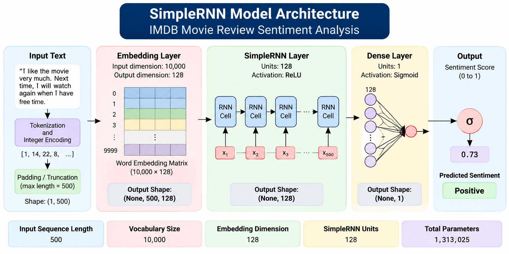

# IMDB Movie Review Sentiment Analysis with SimpleRNN

A deep learning project that classifies IMDB movie reviews as **Positive** or **Negative** using a Simple Recurrent Neural Network (SimpleRNN). The project includes model training, text preprocessing, and an interactive Streamlit web application for sentiment prediction.

## Live Web Application

[Streamlit App]()  

[Watch the Project Demo Video]()

## Neural Network Architecture



## Overview

This project applies Natural Language Processing (NLP) and deep learning to binary sentiment classification using the IMDB movie review dataset. A SimpleRNN model learns sequential patterns in movie reviews and predicts their sentiment.

The trained model is integrated into a Streamlit application, where users can enter their own movie reviews and visualize the prediction.

## Features

- **Sentiment Classification:** Classifies movie reviews as Positive or Negative.
- **Text Preprocessing:** Converts text into integer sequences and applies padding.
- **Word Embedding:** Learns dense word representations using an Embedding layer.
- **SimpleRNN Architecture:** Captures sequential patterns in text.
- **Interactive Web App:** Provides a user-friendly interface built with Streamlit.
- **Prediction Visualization:** Displays sentiment predictions and positive/negative probabilities.
- **Example Reviews:** Includes sample positive and negative reviews for testing.

## Model Architecture

The neural network consists of three layers:

| Layer | Configuration | Output |
|---|---|---|
| Embedding | Input dimension: 10,000; Output dimension: 128 | (None, 500, 128) |
| SimpleRNN | 128 units; ReLU activation | (None, 128) |
| Dense | 1 unit; Sigmoid activation | (None, 1) |

**Total trainable parameters:** 1,313,025

### Model Compilation

- **Optimizer:** Adam
- **Loss Function:** Binary Crossentropy
- **Evaluation Metric:** Accuracy
- **Batch Size:** 32
- **Maximum Epochs:** 10
- **Early Stopping:** Monitors validation loss with a patience of 5 and restores the best weights.

The model was trained using the IMDB dataset with a vocabulary size of 10,000 and a maximum sequence length of 500.

## Dataset

The project uses the **IMDB Movie Review Dataset** provided by Keras.

| Dataset | Number of Reviews |
|---|---:|
| Training | 25,000 |
| Testing | 25,000 |
| Total | 50,000 |

The dataset contains balanced positive and negative movie reviews for binary sentiment classification.

## Technology Stack

| Category | Tools |
|---|---|
| Programming Language | Python |
| Deep Learning | TensorFlow, Keras |
| Neural Network | SimpleRNN |
| NLP | Keras IMDB Dataset, Tokenization, Word Embedding |
| Data Processing | NumPy |
| Web Application | Streamlit |
| Model Format | HDF5 (.h5) |
| Development | Jupyter Notebook |

## Project Structure

```text
E2E-DL-with-SimpleRNN/
│
├── model/
│   └── simple_rnn_imdb.h5
│
├── main.py
├── requirements.txt
├── embedding.ipynb
├── simple_rnn.ipynb
├── prediction.ipynb
└── README.md
```

| File | Description |
|---|---|
| `embedding.ipynb` | Demonstrates word embedding and sequence padding. |
| `simple_rnn.ipynb` | Loads the IMDB dataset, builds and trains the SimpleRNN model, and saves it. |
| `prediction.ipynb` | Explores model prediction using movie review text. |
| `main.py` | Streamlit application for interactive sentiment analysis. |
| `model/simple_rnn_imdb.h5` | Trained SimpleRNN model. |
| `requirements.txt` | Python dependencies. |

## Installation and Usage

### 1. Clone the Repository

```bash
git clone https://github.com/htetaunglynn94/E2E-DL-with-SimpleRNN.git
cd E2E-DL-with-SimpleRNN
```

### 2. Create a Virtual Environment

```bash
python -m venv venv
```

Activate the environment on Linux or macOS:

```bash
source venv/bin/activate
```

### 3. Install Dependencies

```bash
pip install -r requirements.txt
```

### 4. Run the Streamlit Application

```bash
streamlit run main.py
```

Open the local URL displayed in your terminal to access the application.

## How to Use the Application

1. Launch the Streamlit application.
2. Enter a movie review in the text area or select one of the example reviews.
3. Click **Analyze Sentiment**.
4. View the predicted sentiment and positive/negative probabilities.
5. Click **Clear** to remove the current review and prediction.

## Training Workflow

1. Load the IMDB movie review dataset using Keras.
2. Limit the vocabulary to the 10,000 most frequent words.
3. Pad or truncate reviews to a maximum length of 500 tokens.
4. Build the neural network using Embedding, SimpleRNN, and Dense layers.
5. Compile the model with the Adam optimizer and binary crossentropy loss.
6. Train the model with validation data and early stopping.
7. Save the trained model in HDF5 format.
8. Load the model into the Streamlit application for inference.

## Limitations

- The model is trained on IMDB movie reviews and may not generalize equally well to other types of text.
- Short, informal, ambiguous, or context-dependent reviews may be misclassified.
- Predictions depend on the vocabulary and preprocessing used during training.
- The displayed probabilities are model outputs and should not be interpreted as guaranteed confidence.

## Future Improvements

- Experiment with LSTM and GRU architectures.
- Evaluate performance using a confusion matrix, precision, recall, and F1-score.
- Improve preprocessing and handle negation more effectively.
- Compare different neural network architectures.
- Explore pretrained word embeddings and transformer-based models.

## Acknowledgements

- [Keras IMDB Movie Review Dataset](https://keras.io/api/datasets/imdb/)
- [TensorFlow](https://www.tensorflow.org/)
- [Streamlit](https://streamlit.io/)

## Contact

- [LinkedIn](https://www.linkedin.com/in/htetaglynn)
- [GitHub](https://github.com/htetaunglynn94)
